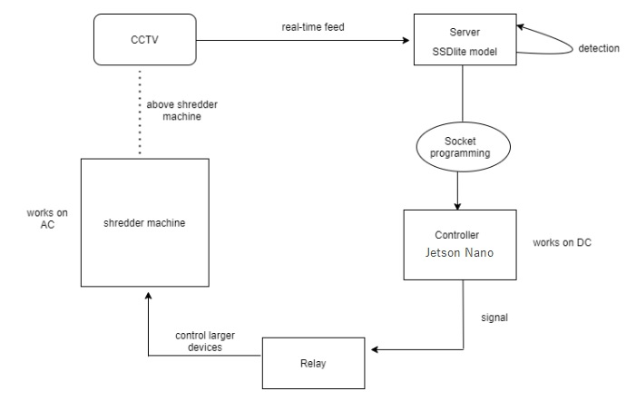
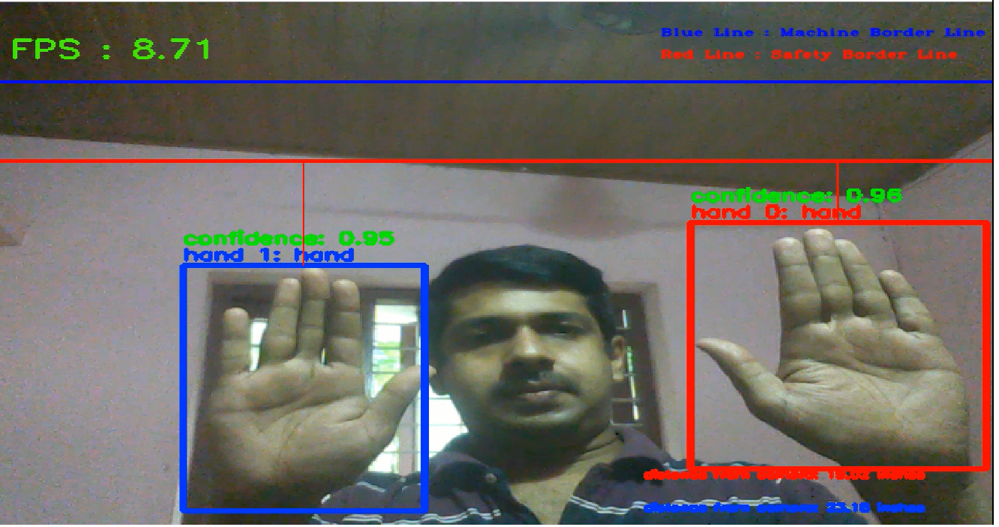
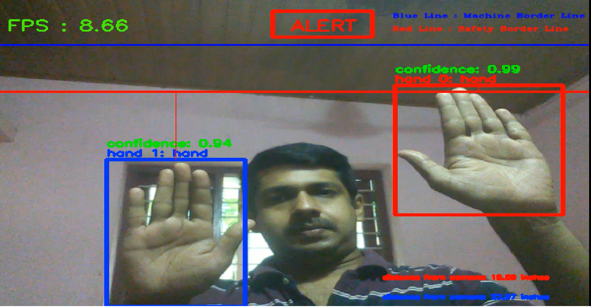

# Hand Safety System with Object Detection

Objective - To stop the shredder machine once the hand reaches too close to the machine to avoid accidents.

The project is built using Tensorflow (1.4) Object detection where the SSD model has been trained for detecting hands in an image,
A Warning and a Machine stop line has been created identifying if the hand is too close to the machine, once the hand reaches the 
warning line the programs creates a warning beep sound notifying that the hand has breached the safe distance limit, similarly
if the hand crosses the Machine stop line, program signals the machine to stop immediately to avoid any accident.

## Dataset:
We have used custom dataset taken from the camera under different lighting conditions(day and night), varying distance.

## Project design

## Camera Popup UI

